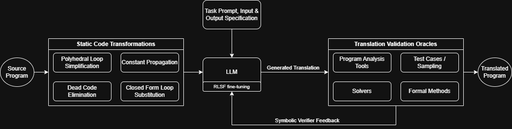

# SynTran

SynTran (Syntactic Translation) is a generic LLM-based code translation tool capable of handling many translation tasks.

Many problems can be considered as a translation task:
- Programming model modernization
  - Fortran → C/C++
  - CUDA → OpenMP & OpenACC
  - MPI → OpenSHMEM
  - Floating Point → Fixed-point or alternative schemes
- Auto Parallelization
- Natural Language Description → Code
- Invariant Generation
- Optimization
- Decompilation
- etc. 

Syntran's general design is shown in the flowchart below:

By specifying the desired transformations, prompt and specification, oracle, and oracle feedback format, you can leverage the automated feedback loop and reinforcement learning infrastructure already established to perform code translation utilizing your available computing resources and preferred model.